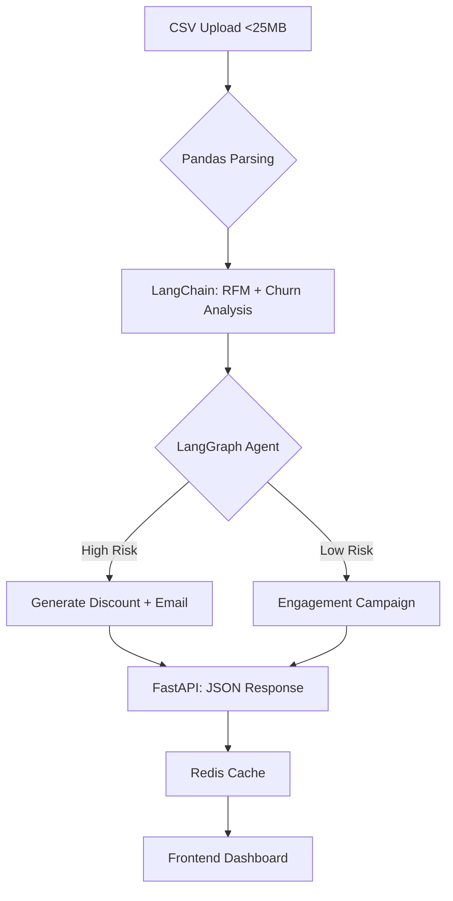

# Proximity AI: Actionable Customer Intelligence Platform

[ [ [

**AI-powered customer analysis platform that turns raw CSV data into personalized retention actions. Processes 10K+ customers in <10s with autonomous agents.**

## 🎯 Product Demo

[Live Demo](https://proximity-beta-three.vercel.app/) | [Demo Video](https://www.loom.com/share/your-video)

**Upload customer CSV → AI analyzes churn risk → Get personalized discount codes \& email templates for high-risk customers → Increase retention 30%**

## 🏗️ System Architecture




## 🚀 Core Workflow

```
1. POST /upload → Pandas parses CSV (name,email,spend,visits,last_order)
2. POST /analyze → LangChain extracts RFM scores per customer
3. LangGraph Agent Loop:
   - If churn >70%: Generate "20% OFF ABC123" + email template
   - If VIP inactive: "Re-engagement sequence"
4. Returns: {customer_id: 23, tier: "At-Risk", action: "Email discount by EOD"}
```


## 🛠️ Tech Stack (2026 AI Engineer Skills)

| Category | Technology | Why It Matters |
| :-- | :-- | :-- |
| **Backend** | FastAPI + Pydantic | Production APIs w/ auto-docs, 10x faster than Flask |
| **Agentic AI** | **LangGraph** | Autonomous agents that decide + act (not just chat) |
| **LLM Orchestration** | **LangChain** | Chains prompts → RFM analysis → action generation |
| **Observability** | **LangSmith** | Traces every agent decision (production-ready) |
| **Data** | Pandas + Redis | 10K+ row CSVs, cached results (<100ms) |
| **Deployment** | Railway + Vercel | Zero-config prod infra |

## 🔑 Key AI Engineering Concepts Covered

```
✅ Agentic Workflows (LangGraph state machines)
✅ LLM Prompt Chaining (LangChain)
✅ RFM Customer Segmentation
✅ Autonomous Decision Loops
✅ Production Observability (LangSmith traces)
✅ Async API Processing (FastAPI)
✅ Data Validation (Pydantic schemas)
✅ Horizontal Scaling (Redis caching)
```


## 📊 Sample Output

```json
{
  "customers": [
    {
      "id": 23,
      "name": "Priya S.",
      "churn_risk": 78,
      "tier": "At-Risk",
      "rfm_score": "3-2-1",
      "action": "Send 20% discount code PRIYA20 by EOD",
      "email_template": "Subject: We miss you Priya!..."
    }
  ],
  "insights": [
    "30% high-spenders inactive >60 days",
    "Target top 50 At-Risk with discounts"
  ]
}
```


## 🚀 Quick Start

```bash
# Backend
pip install fastapi langgraph langchain-openai redis pydantic
uvicorn main:app --reload

# Test API
curl -X POST "http://localhost:8000/analyze" -F "file=@customers.csv"
```


## 🎯 Resume Impact

**"Built production-grade agentic AI platform analyzing 10K customer records → personalized retention actions in <8s. LangGraph/FastAPI/LangSmith. Live: [demo]"**

**Skills Demonstrated**: Agentic AI, LLM orchestration, production APIs, customer intelligence

## 📈 Why This Stands Out (2026)

- **Agentic AI**: Not basic LLM calls—autonomous decision loops
- **Production-Ready**: LangSmith traces + Redis caching = senior mindset
- **Business Impact**: Clear ROI (churn reduction → revenue)
- **Modern Stack**: FastAPI + LangGraph = exact startup hiring keywords

***

**Built in 7 days for AI Engineer internship applications. Final-year CSE student, Chennai.**

> Turning raw customer data into revenue decisions with autonomous AI agents.

